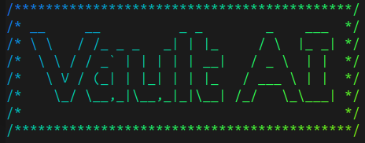

# Vault: AI-Powered Digital Banking Platform (In-Progress)

A full-stack microservices-based digital banking platform featuring an intelligent conversational AI assistant that helps users query their financial data and bank policies using natural language. Built with modern AI/ML technologies including LangChain, LangGraph, and RAG (Retrieval Augmented Generation).

<p align="center">
    
</p>

## Features

- **Conversational AI Banking Assistant**: Natural language interface powered by Google Gemini 2.5 Flash Lite
- **RAG-Powered Policy Search**: Semantic search over banking policy documents using vector embeddings
- **Advanced Spending Analytics**: Multi-dimensional spending analysis with filtering by category, date range, account type, and merchant
- **Balance Queries**: Real-time account balance retrieval across multiple account types
- **Intelligent Query Routing**: LangGraph-based state machine that automatically routes queries to appropriate tools
- **Vector Similarity Search**: Fast semantic search using pgvector and Hugging Face sentence transformers
- **Synthetic Data Generation**: Realistic test data generation for 10,000+ users with proper relationships and transaction patterns


### Services

The platform follows a microservices architecture with the following services:
- **Agent Service**: Orchestrates user queries using LangGraph, routes to appropriate tools, and generates responses
- **Database Service**: Handles spending analytics and balance queries via FastAPI REST endpoints
- **Vectorstore Service**: Manages vector embeddings and semantic search for policy documents

## Tech Stack

**Backend:**
- Python 3.12
- FastAPI
- Uvicorn

**Database:**
- PostgreSQL (Supabase)
- pgvector (vector similarity search)

**AI/ML:**
- LangChain
- LangGraph
- Google Gemini 2.5 Flash Lite
- Hugging Face Transformers
- PyTorch
- sentence-transformers (all-MiniLM-L6-v2)

**Tools & Utilities:**
- Faker (synthetic data generation)
- python-dotenv
- httpx


## Project Structure
```text
Vault/
├── backend/
│   ├── agent-service/          # AI agent orchestration
│   │   ├── app/
│   │   │   ├── tools/          # Agent tools (RAG, SQL, Balance)
│   │   │   ├── llm/            # LLM prompts
│   │   │   └── utils/          # Utilities
│   │   └── tests/              # Test suites
│   ├── database-service/        # Analytics and balance APIs
│   │   ├── app/
│   │   │   ├── api/routes/     # FastAPI routes
│   │   │   ├── services/       # Business logic
│   │   │   └── config/         # Database config
│   └── vectorstore-service/     # Vector search service
│       ├── app/
│       │   ├── vectorstore/    # Embeddings and search
│       │   └── api/routes/     # Search endpoints
├── data/
│   ├── scripts/                # Data generation and loading
│   ├── synthetic/              # Generated CSV files
│   └── policy/                 # Policy documents
├── api-gateway/                # API gateway (future)
├── frontend/                   # Frontend (future)
└── infrastructure/             # Docker and deployment configs
```